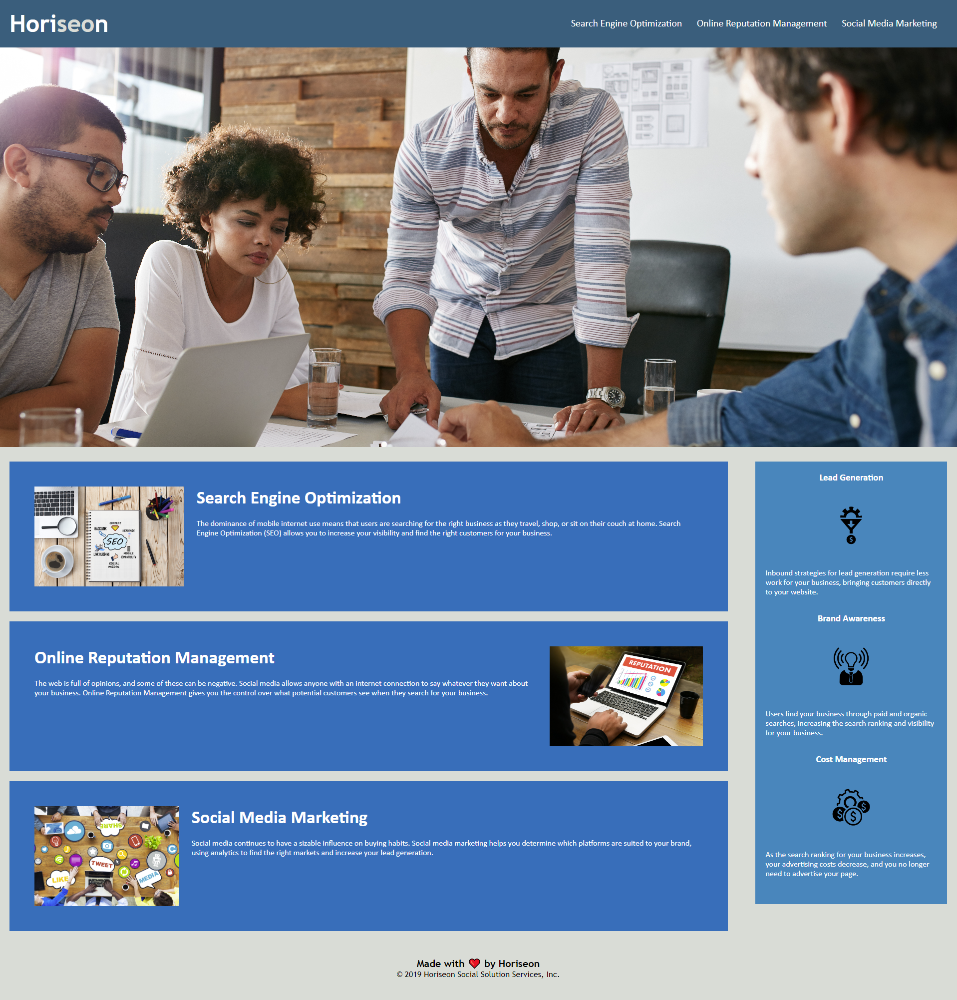

# Horiseon Webpage Week 1 Challenge Edmond Su

## Description

The purpose of this project was to gain experience of possible real world on the job projects where we are required to modify existing code. Here I learnt the purpose of using correct html semantics as originally there was none, making it hard to follow the code. I also learnt the importance of commenting as it gives other people that may read your code what that line or section of code is doing. I also learnt importance of using id and class properties  streamline code by using id and class properties correctly to reduce repetition of code.

## Installation

N/A

## Usage
Link to the webpage: https://deverstater07.github.io/Horiseon-Webpage-Week-1-Challenge-Edmond-Su/

Navigation buttons are in the top right along the header bar. Left click on which section you would like to goto.

## Credits

N/A

## License

N/A